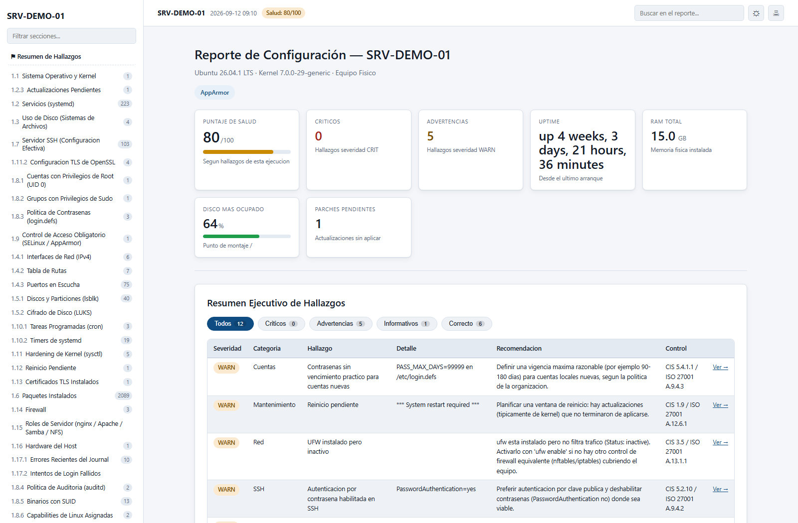
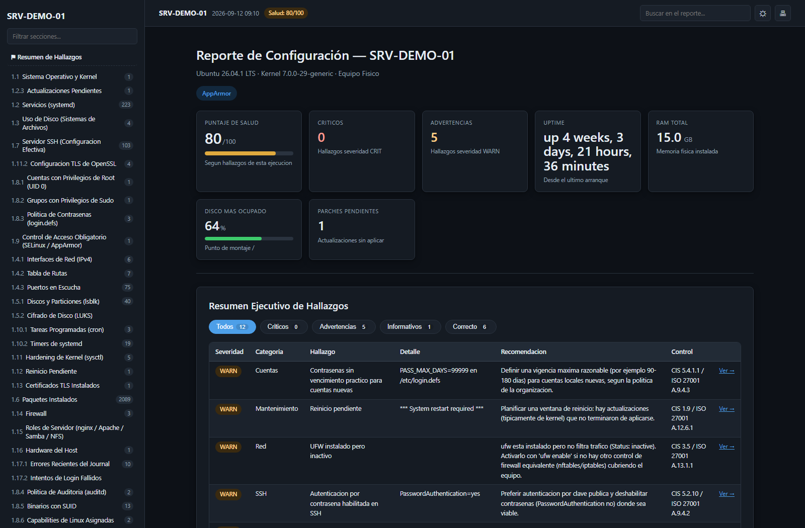
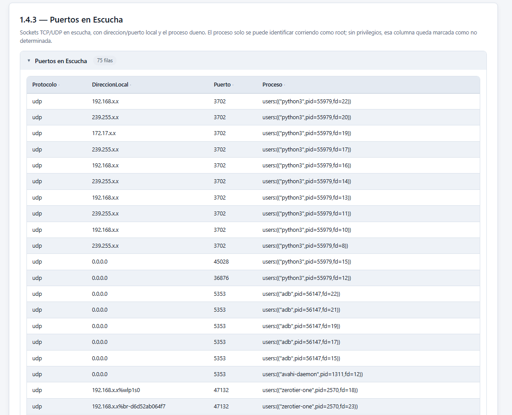

[](README.md)
[](README.en.md)

# Cat-ServerFullReport

**Inventario as-built y health check de servidores Linux en un solo script de bash.**

[](#requisitos)
[](#compatibilidad)
[](LICENSE)
[](#seguridad)
[](#requisitos)
[](#formatos-de-salida)

Levanta **41 secciones** de configuración de un servidor Linux, las analiza con **14 tópicos de reglas** mapeados a controles CIS e ISO 27001, y entrega un reporte HTML navegable con un resumen ejecutivo de hallazgos arriba. Sirve tanto para documentar (as-built formal, anexo de auditoría) como para revisar (qué está mal hoy en este servidor).

Un solo archivo. Sin módulos, sin instalación, sin conexión a internet, sin `jq` ni Python. Copiar y ejecutar.

<p align="center">
  
</p>

<details>
<summary>Ver en tema oscuro</summary>
<p align="center">
  
</p>
</details>

> **Estado: `v0.1.0-slice` — prueba de concepto funcional, no un MVP terminado.**
> El script corre de punta a punta y genera reportes completos contra equipos reales,
> pero está validado solo en Ubuntu, CentOS Stream 9 y openSUSE Leap. Ver [Compatibilidad](#compatibilidad).

Es el hermano Linux de [Get-ServerFullReport](https://github.com/KikeMuller/Get-ServerFullReport) (Windows / PowerShell): mismo esquema de reporte, mismo lenguaje visual del HTML y la misma disciplina de no afirmar nada sobre un dato que no se pudo leer.

---

## Índice

- [Por qué](#por-qué)
- [Por qué bash y no Python](#por-qué-bash-y-no-python)
- [Instalación](#instalación)
- [Uso](#uso)
- [Opciones](#opciones)
- [Ejecutarlo como root](#ejecutarlo-como-root)
- [Auditar un servidor remoto](#auditar-un-servidor-remoto)
- [Qué recolecta](#qué-recolecta)
- [El motor de hallazgos](#el-motor-de-hallazgos)
- [Formatos de salida](#formatos-de-salida)
- [Versión compartible (`--redact`)](#versión-compartible---redact)
- [Capturas del reporte](#capturas-del-reporte)
- [Requisitos](#requisitos)
- [Compatibilidad](#compatibilidad)
- [Seguridad](#seguridad)
- [Limitaciones conocidas](#limitaciones-conocidas)
- [Contribuir](#contribuir)
- [Licencia](#licencia)

---

## Por qué

En Linux la información existe, pero está repartida en veinte comandos distintos: `lsblk`, `ss`, `systemctl`, `sysctl`, `dmidecode`, `journalctl`, `sshd -T`, `auditctl`. Juntarla a mano lleva media hora por servidor, y el resultado es un pegote de salidas de consola que nadie va a leer dos veces.

`cfg2html` resuelve la recolección, pero entrega un volcado: no evalúa nada, no prioriza, no dice qué está mal. Los inventarios comerciales cuestan y hay que desplegar un agente.

Este script cubre ese hueco: un archivo que se copia al servidor, se ejecuta, y deja un documento completo **y** una lista priorizada de lo que hay que arreglar, con la referencia al control CIS o ISO que corresponde.

## Por qué bash y no Python

Porque hay servidores que no tienen Python instalado, a veces por política de seguridad. Un script de bash sin dependencias corre en cualquier servidor Linux tal como viene de fábrica; uno de Python obliga a verificar intérprete, versión y módulos antes de poder auditar nada — justo en los equipos donde menos se quiere instalar cosas.

De ahí salen las tres reglas que definen el proyecto:

- **Un solo archivo.** Se copia y corre. No hay paquete, ni instalador, ni `pip install`.
- **Cero dependencias fuera del sistema base.** Solo coreutils, procps, systemd y utilidades que ya están en cualquier distro de servidor. En particular **no usa `jq`**: el formato interno es TSV, no JSON, precisamente para no depender de él.
- **Solo lectura.** El script nunca modifica el equipo auditado. No inicia servicios, no abre puertos, no escribe fuera de sus propios archivos temporales.

## Instalación

No hay instalación. Se descarga el archivo y se le da permiso de ejecución:

```bash
curl -fsSLO https://raw.githubusercontent.com/KikeMuller/Cat-ServerFullReport/main/cat-serverfullreport
chmod +x cat-serverfullreport
```

O se clona el repositorio, o se copia el archivo por `scp` desde donde sea. Cualquiera de las tres sirve: es un único archivo de texto sin nada alrededor.

## Uso

```bash
# Inventario completo del equipo local
sudo ./cat-serverfullreport -o /tmp

# Barrido rápido de seguridad: solo cuentas y firewall
sudo ./cat-serverfullreport --sections 1.8,1.14

# Sin el inventario de paquetes ni lo de Python, que son las secciones largas
sudo ./cat-serverfullreport --skip-sections 1.6,1.19

# Los tres formatos de salida
sudo ./cat-serverfullreport --format HTML,JSON,MD -o /tmp

# Versión para compartir fuera de la organización
sudo ./cat-serverfullreport --redact -o /tmp

# Todo, incluido lo lento
sudo ./cat-serverfullreport --include-missing-updates --scan-git-repos --event-log-days 14
```

Genera `AsBuilt_<hostname>_<fecha>.html` en la carpeta indicada. Se abre en cualquier navegador; el HTML es autocontenido (CSS y JS embebidos), así que se puede adjuntar por correo o guardar sin nada alrededor.

Con `-q` la única salida son las rutas generadas, una por línea, lo que permite encadenarlo:

```bash
ruta="$(sudo ./cat-serverfullreport -q -o /tmp)"
```

## Opciones

| Opción | Qué hace |
|---|---|
| `-o`, `--output DIR` | Carpeta donde escribir el reporte. Por defecto, el directorio actual. |
| `-q`, `--quiet` | Silencia los mensajes de progreso. Sigue imprimiendo la ruta de cada archivo generado en stdout, para poder capturarla. |
| `--format LISTA` | Formatos de salida separados por comas: `HTML`, `JSON`, `MD`. Por defecto `HTML`. |
| `--redact` | Versión compartible: enmascara IPs, cuentas, rutas personales y números de serie. |
| `--sections LISTA` | Solo estas secciones, por prefijo de id, separadas por comas. |
| `--skip-sections LISTA` | Omite estas secciones. |
| `--event-log-days N` | Días hacia atrás para los errores del journal. Por defecto, 7. |
| `--scan-git-repos` | Busca repositorios Git en `/home` y `/root`. Desactivado por defecto porque puede tardar. |
| `--include-missing-updates` | Consulta actualizaciones pendientes. Desactivado por defecto porque puede tardar. |
| `-h`, `--help` | Ayuda. |

## Ejecutarlo como root

**Se recomienda ejecutarlo como root o con `sudo`.** El script funciona sin privilegios y nunca falla por falta de ellos, pero varias secciones quedan incompletas porque el kernel simplemente no entrega esos datos a un usuario común:

| Sección | Sin root | Con root |
|---|---|---|
| 1.7 Servidor SSH | Solo el archivo de configuración | Configuración **efectiva** completa (`sshd -T`) |
| 1.14 Firewall | Solo si el servicio está activo | Las reglas cargadas |
| 1.16 Hardware | Todo salvo el número de serie | Incluye número de serie (`dmidecode`) |
| 1.8.4 Política de auditoría | Vacía | Reglas de `auditd` |
| 1.10.1 Tareas programadas | Solo el crontab del usuario actual | Crontabs de todos los usuarios |
| 1.4.3 Puertos en escucha | Puertos, sin dueño | Puertos con el proceso que los abrió |
| 1.9 SELinux / AppArmor | Estado general | Perfiles cargados |
| 1.17.4 Salud SMART | No disponible | Estado de cada disco físico |

Sin root el reporte se genera igual y cada sección afectada dice explícitamente por qué está incompleta. Nunca se inventa un valor ni se marca como correcto algo que no se pudo verificar.

## Auditar un servidor remoto

El script **siempre corre local, en el equipo auditado**. Para un servidor remoto se lo copia y se lo ejecuta allá:

```bash
scp cat-serverfullreport servidor:/tmp/
ssh servidor 'chmod +x /tmp/cat-serverfullreport && sudo /tmp/cat-serverfullreport -o /tmp'
scp servidor:/tmp/AsBuilt_*.html ./
```

No es un rodeo: un solo archivo sin dependencias se copia a cualquier parte y corre. Un modo remoto nativo por SSH multiplexado queda como idea pendiente, sin fecha (ver [CONTRIBUTING.md](CONTRIBUTING.md)).

## Qué recolecta

**41 secciones** agrupadas por tema. El detalle completo, con los nombres exactos de columna de cada una, está en **[docs/INVENTARIO_SECCIONES.md](docs/INVENTARIO_SECCIONES.md)**.

| Grupo | Secciones |
|---|---|
| **Sistema** | Sistema operativo y kernel · Servicios de systemd · Paquetes instalados · Actualizaciones pendientes · Reinicio pendiente |
| **Almacenamiento** | Uso de disco · Discos y particiones · Cifrado LUKS |
| **Red** | Interfaces IPv4 · Tabla de rutas · Puertos en escucha |
| **Seguridad** | Cuentas UID 0 · Grupos sudo · Política de contraseñas · Usuarios locales · Política de auditoría · Binarios SUID · Capabilities · SELinux / AppArmor · Firewall · Hardening de kernel (sysctl) |
| **TLS** | Certificados instalados · Configuración TLS de OpenSSL |
| **Programación** | Tareas de cron · Timers de systemd |
| **Salud** | Errores del journal · Logins fallidos · Top 15 procesos por memoria · Salud SMART · Apagados inesperados |
| **Plataforma** | Hardware del host · Roles de servidor (nginx / Apache / Samba / NFS) · Sincronización NTP · Python e intérpretes · Paquetes pip · Entornos virtuales · Repositorios Git · Contenedores Docker |
| **Protección** | Antivirus / EDR detectado · Agentes de backup detectados |

Cuando un rol no está instalado, la sección **se registra igual** con una explicación. El índice queda completo y el as-built documenta de forma explícita que ese rol no existe en el equipo, que es información tan válida como su configuración.

## El motor de hallazgos

**14 tópicos de evaluación** que producen hallazgos clasificados en `CRIT`, `WARN`, `INFO` y `OK`, con categoría, evidencia concreta, recomendación y referencia al control correspondiente (CIS / ISO 27001).

El principio central, heredado de la versión Windows:

> Ninguna regla emite un hallazgo — ni negativo ni positivo — sobre un dato que no pudo leer. Un `OK` falso es peor que el silencio, porque el administrador confía en él.

En la práctica, cada regla verifica primero que el dato exista y sea utilizable; si no lo es, no dice nada. Un ejemplo real de por qué importa: los montajes de solo lectura de `snap` siempre reportan 100 % de uso por diseño. Evaluarlos como un disco normal producía **ocho falsos `CRIT`** en cualquier Ubuntu con snapd instalado. Hoy se excluyen explícitamente.

El puntaje de salud parte de 100 y descuenta 12 por cada `CRIT` y 4 por cada `WARN`. Los `INFO` no descuentan.

## Formatos de salida

```bash
sudo ./cat-serverfullreport --format HTML,JSON,MD -o /tmp
```

Los tres archivos de una misma ejecución comparten el timestamp del nombre, así que se corresponden entre sí sin ambigüedad.

| Formato | Para qué sirve |
|---|---|
| `HTML` | Reporte navegable, autocontenido. Es el que se lee y se comparte. |
| `JSON` | Para ingesta automatizada: CMDB, inventario, comparación entre ejecuciones. |
| `MD` | Para pegar en un ticket, un wiki o un pull request sin adjuntar archivos. |

El **JSON usa el mismo esquema que la versión Windows** (`Metadata`, `Capabilities`, `Findings`, `FindingsSummary`, `Sections`), de modo que una herramienta que consuma el inventario de un servidor Windows funciona igual con uno Linux. Sale en UTF-8 sin BOM y con fechas ISO 8601.

Dos decisiones del JSON que conviene conocer:

- **Todos los valores de `Data` y `Findings` son strings.** Los únicos números reales son `RowCount`, los contadores de `FindingsSummary` y `TiempoTotalSegundos`. Emitir números desnudos desde bash arriesga producir JSON inválido cuando el valor es `N/D`, `221.1M` o está vacío.
- **Se sanean los bytes no válidos en UTF-8** antes de cerrar el archivo. La especificación de JSON exige UTF-8 válido, así que un solo byte inválido —los nombres de archivo en Linux son cadenas de bytes, no texto garantizado— haría que un parser estricto rechace el reporte completo. Un navegador, en cambio, tolera esos bytes, y por eso el HTML no necesita el saneado.

## Versión compartible (`--redact`)

Enmascara lo que identifica al equipo y a sus usuarios, conservando lo que hace útil la auditoría:

| Se enmascara | Ejemplo |
|---|---|
| Direcciones IPv4 e IPv6 | `192.0.2.58%eth0` → `192.0.x.x%eth0` |
| Cuentas de usuario | `ana,pedro` → `a****,p****` |
| Rutas de directorios personales | `/home/ana/proyectos/x` → `/home/a****/...` |
| Números de serie | `7X2K9Q1` → `7X****` |
| Direcciones MAC y hashes largos | dentro del texto de los hallazgos |

**Lo que deliberadamente NO se enmascara**, porque no identifica a nadie y es el contenido mismo de la auditoría:

- Las rutas de sistema (`/usr/bin/sudo` en la tabla de binarios SUID seguiría siendo legible).
- Las direcciones comodín y de loopback (`0.0.0.0`, `127.0.0.1`): distinguir "escuchando en todas las interfaces" de "escuchando solo en local" es justamente el dato que hace útil la sección de puertos.
- Las versiones de paquetes y del kernel. Esto importa más de lo que parece: la versión del kernel `6.6.87.2` tiene forma de dirección IPv4, y enmascararla por descuido destruiría un dato central del inventario.

`--redact` se aplica a los tres formatos de salida por igual.

## Capturas del reporte

Las capturas de este README salen de una ejecución real como root sobre un equipo Ubuntu, con `--redact` activo y el nombre del host reemplazado por `SRV-DEMO-01`.

### Portada: puntaje, KPI y resumen ejecutivo

[`docs/img/reporte-light.png`](docs/img/reporte-light.png) — Lo primero que se ve al abrir el reporte:

- **Índice lateral filtrable** con el número de filas de cada sección, para saber de un vistazo dónde hay datos y dónde no.
- **Tarjetas KPI**: puntaje de salud, conteo de críticos y advertencias, uptime, RAM, disco más ocupado y parches pendientes.
- **Resumen ejecutivo de hallazgos** con filtros por severidad y un enlace `Ver →` desde cada hallazgo a la sección que lo originó. Cada fila trae la evidencia concreta (`PASS_MAX_DAYS=99999 en /etc/login.defs`), no una afirmación genérica.

### Tema oscuro

[`docs/img/reporte-dark.png`](docs/img/reporte-dark.png) — El mismo reporte con el tema oscuro. La preferencia se guarda en `localStorage`, así que sobrevive a recargas y a compartir el archivo.

### Tablas de datos y enmascarado

<p align="center">
  
</p>

[`docs/img/reporte-tabla.png`](docs/img/reporte-tabla.png) — Una sección de datos, con dos cosas que vale la pena mirar de cerca:

- **Encabezados ordenables** y el conteo de filas junto al título de cada subsección.
- **`--redact` en funcionamiento**: las direcciones reales aparecen como `192.168.x.x`, incluido el caso con sufijo de zona (`192.168.x.x%wlp1s0`), mientras `0.0.0.0` queda intacto a propósito — es lo que permite distinguir un servicio expuesto en todas las interfaces de uno que solo escucha en local.

Esta captura se tomó con `--sections 1.4.3,1.16`, así que también muestra el filtrado de secciones: el índice lateral queda con solo las dos pedidas, y las tarjetas KPI que dependen de secciones no relevadas dicen `N/D` con el motivo, en vez de inventar un cero.

> **[Ver un reporte de ejemplo completo](docs/reporte-ejemplo.html)** — descárgalo y ábrelo en el navegador (GitHub no renderiza HTML embebido).

## Requisitos

- **bash 4.0 o superior.** Se usan arreglos asociativos, `${var,,}` y expansión de parámetros con clases de caracteres. Cualquier distro de servidor desde 2010 lo cumple.
- **coreutils, procps y `util-linux`**, que son parte del sistema base.
- **systemd** para las secciones de servicios y timers. En un equipo con otro init, esas secciones se registran con la explicación correspondiente en vez de fallar.
- Opcionales, cada uno habilita una sección: `dmidecode` (número de serie), `smartmontools` (salud SMART), `auditd` (política de auditoría), `openssl` (configuración TLS), `docker` (contenedores).

No se persigue compatibilidad con `sh` POSIX estricto.

## Compatibilidad

| Distribución | Estado |
|---|---|
| Ubuntu 24.04 / 26.04 | **Probado**, incluyendo una ejecución como root con `LANG=es_ES.UTF-8` |
| Debian | Esperado equivalente a Ubuntu; no probado directamente |
| CentOS Stream 9 | **Probado** en una VM real (KVM), incluidas las ramas de `dnf`, `firewalld` y `update-crypto-policies`. Ver [Compatibilidad probada en RHEL](#compatibilidad-probada-en-rhel). |
| RHEL / Rocky / Alma / Fedora | No probados directamente, pero comparten base con CentOS Stream 9 (mismo `dnf`, `systemd`, `firewalld`, SELinux) |
| openSUSE Leap 15.6 | **Probado** en una VM real (KVM), incluida la rama de `zypper` con bash 4.4 (el piso mínimo del proyecto). Ver [Compatibilidad probada en SUSE](#compatibilidad-probada-en-suse). |
| SLES / openSUSE Tumbleweed | No probados directamente, pero comparten `zypper`/`rpm` con openSUSE Leap |
| Alpine / Arch | **Parcial.** Los paquetes instalados se listan (`apk`, `pacman`), pero las actualizaciones pendientes no: esa sección informa que el gestor no tiene consulta implementada |

Si lo pruebas en alguna de las no validadas, un reporte de resultado es muy bienvenido.

El script fuerza `LC_ALL=C` en todos los comandos externos, así que funciona igual en servidores configurados en cualquier idioma. Esto salió de un problema real: en un equipo con `LANG=es_ES.UTF-8`, `lsblk` devolvía tamaños como `221,1M` en vez de `221.1M`, y los parsers fallaban en silencio.

### Compatibilidad probada en RHEL

La familia RHEL se probó en una VM real (CentOS Stream 9, imagen cloud oficial sobre KVM/libvirt), no solo contra la documentación. La prueba encontró y corrigió un bug real: la sección de firewall nunca intentaba leer reglas de `firewalld` —solo probaba `ufw`, `nft` e `iptables`— así que en un servidor RHEL típico, con root y firewalld activo, decía "no se pudieron leer sin privilegios de root" siendo falso: sí había privilegios, faltaba la rama de código. Corregido agregando `firewall-cmd --list-all-zones` y distinguiendo el motivo real (sin privilegios / sin herramienta instalada / herramienta detectada pero sin datos) en vez de un mensaje fijo.

Confirmado en esa misma VM:

- `dnf check-update` interpretado correctamente (código 0 sin salida = sin actualizaciones pendientes; código 100 = sí hay, según la documentación de dnf).
- `update-crypto-policies --show` devolviendo `DEFAULT` correctamente.
- SELinux vía `getenforce` (`Enforcing`), la contraparte de AppArmor en esta familia.
- Degradación sin privilegios: mismo comportamiento que en Ubuntu, sin errores de bash.

Rocky Linux, AlmaLinux y RHEL propiamente dicho no se probaron directamente, pero comparten base binaria con CentOS Stream 9 (mismo `dnf`, `systemd`, `firewalld`, SELinux), así que el riesgo residual es bajo.

### Compatibilidad probada en SUSE

La familia SUSE se probó en una VM real (openSUSE Leap 15.6, imagen cloud oficial sobre KVM/libvirt). La prueba encontró y corrigió dos bugs reales en la rama `zypper` de actualizaciones pendientes:

- **Sin refresco previo de repositorios.** A diferencia de la rama `apt`, que refresca el índice antes de consultar (con el mismo motivo documentado en el código: evitar falsos negativos contra un cache viejo), la rama `zypper` no lo hacía. En un equipo recién aprovisionado, la primera consulta de `zypper` necesitó construir el cache de un repositorio —tardó varios segundos reales— y el `timeout` de la consulta la mataba antes de que imprimiera nada: el reporte decía "sin actualizaciones pendientes" cuando en realidad había cuatro.
- **El `awk` no excluía la fila de encabezado de la tabla de `zypper list-updates`.** La fila `S | Repository | Name | Current Version | Available Version | Arch` cumple las mismas condiciones que una fila de datos real y se colaba como si fuera un paquete llamado "Name".

Corregido agregando `zypper refresh` con root (mismo patrón que `apt-get update`) y excluyendo el encabezado por el contenido exacto del campo, no por posición.

Confirmado en esa misma VM:

- **bash 4.4.23**, la versión más antigua de las tres distribuciones probadas — valida en la práctica el piso `bash 4.0+` que el proyecto declara, no solo en teoría.
- `rpm -qa --queryformat` (backend real de `zypper`) listando 591 paquetes correctamente.
- `iptables -L -n` (firewall detectado en esta imagen, sin firewalld ni nft instalados) devolviendo reglas reales.
- AppArmor vía `aa-status`, tercera confirmación en vivo del mismo mecanismo que Ubuntu, distinto de SELinux en RHEL.

SUSE Linux Enterprise Server (SLES) y openSUSE Tumbleweed no se probaron directamente, pero comparten `zypper` y el formato `rpm` con openSUSE Leap.

## Seguridad

- **Solo lectura, sin excepciones.** No inicia servicios, no abre puertos, no escribe fuera de sus archivos temporales, que limpia al salir.
- **Nunca abre conexiones de red hacia terceros.** La única excepción es `--include-missing-updates`, que consulta los repositorios ya configurados en el equipo, y está desactivado por defecto.
- **Las credenciales embebidas en URLs de Git se enmascaran** siempre, incluso sin `--redact`.
- **Todo comando externo pasa por una capa con `timeout`.** Sin eso, un montaje NFS con el servidor caído o un LDAP inalcanzable en `nsswitch.conf` cuelgan el reporte completo.
- **Un reporte sin `--redact` contiene datos sensibles**: cuentas locales, IPs internas, puertos en escucha, número de serie del equipo. Trátalo como tal, y usa `--redact` para cualquier copia que salga de la organización.

## Limitaciones conocidas

- **No determina qué protocolos TLS acepta realmente el sistema.** La sección 1.11.2 reporta versión de OpenSSL y configuración explícita, pero no emite veredicto de cumplimiento. La única forma confiable de saberlo es abrir una conexión TLS real, y el script es de solo lectura. Documentado en detalle en el propio código.
- **Actualizaciones pendientes con `apk` y `pacman`** no está implementado.
- **Rocky Linux, AlmaLinux y RHEL propiamente dicho no se probaron directamente** (solo CentOS Stream 9; ver [Compatibilidad probada en RHEL](#compatibilidad-probada-en-rhel)).
- **SLES y openSUSE Tumbleweed no se probaron directamente** (solo openSUSE Leap 15.6; ver [Compatibilidad probada en SUSE](#compatibilidad-probada-en-suse)).

Respecto de la versión Windows, todavía faltan estas capacidades:

| Falta | Equivalente en Windows |
|---|---|
| Exportación a CSV (ya genera HTML, JSON y Markdown) | `-Format CSV` |
| Comparación contra un levantamiento anterior (drift) | `-BaselinePath` |
| Auditar varios equipos en una sola ejecución | `-ComputerName` con varios nombres, `-ThrottleLimit` |
| Muestreo de contadores de rendimiento | `-PerfSampleSeconds` |

## Contribuir

Las reglas del proyecto, las plantillas para agregar secciones y reglas, y el procedimiento de prueba están en **[CONTRIBUTING.md](CONTRIBUTING.md)**. Casi todas las reglas duras de ese archivo vienen de un bug real que costó tiempo encontrar, y varias fallan en silencio: conviene leerlas antes de tocar el script.

El historial de cambios está en [CHANGELOG.md](CHANGELOG.md).

## Licencia

MIT. Ver [LICENSE](LICENSE).
